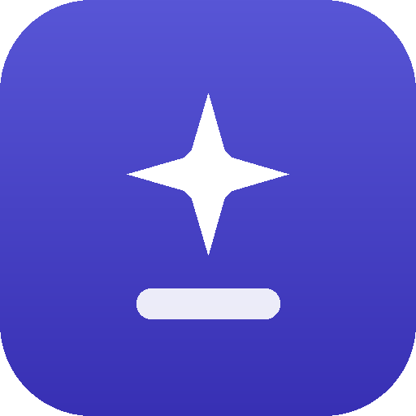
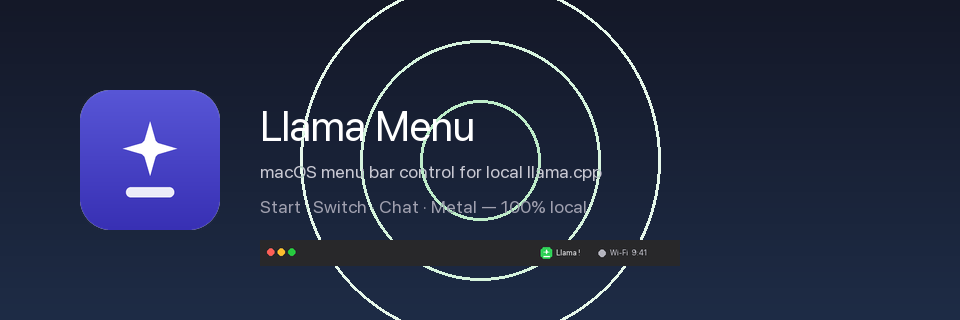
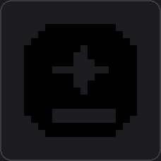
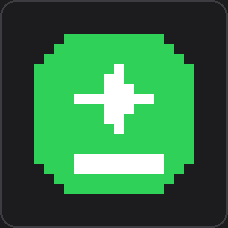
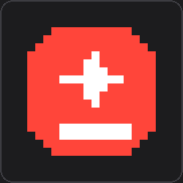
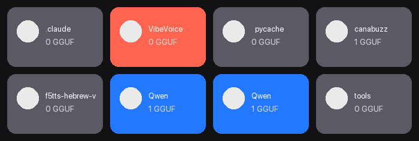
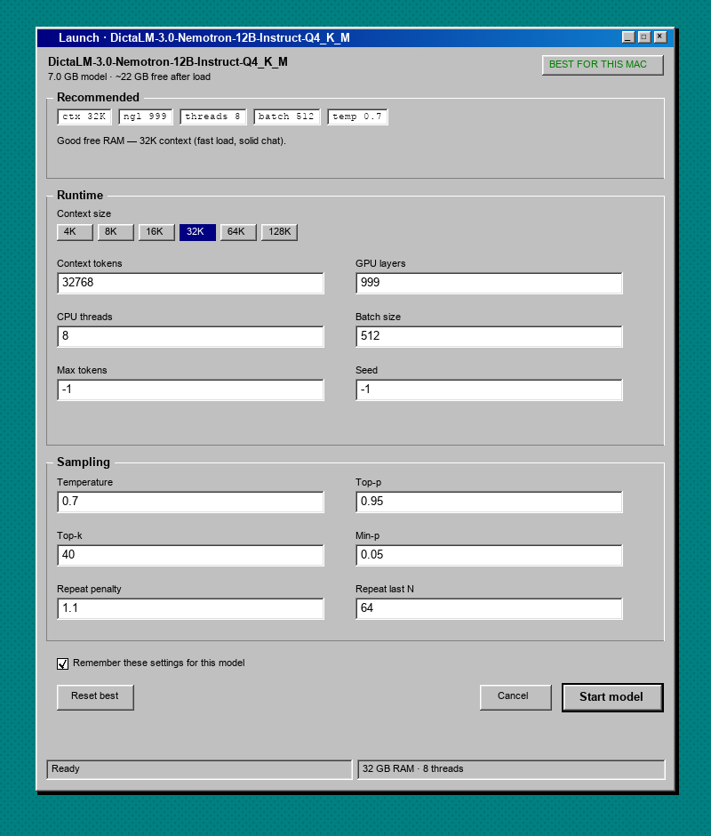

<p align="center">
  
</p>

<h1 align="center">Llama Menu</h1>

<p align="center">
  <strong>Native macOS menu bar control for local <a href="https://github.com/ggml-org/llama.cpp">llama.cpp</a></strong><br/>
  Start · switch · stop GGUF models · open chat · Metal — all on your Mac
</p>

<p align="center">
  
</p>

<p align="center">
  
  
  
  
  
  
</p>

<p align="center">
  <a href="#install">Install</a> ·
  <a href="#usage">Usage</a> ·
  <a href="#menu-bar-status">Menu bar</a> ·
  <a href="#models">Models</a> ·
  <a href="#config">Config</a>
</p>

---

## Why Llama Menu?

| | |
|:--|:--|
| **Tiny** | Native Swift menu bar host (~200 KB binary + resources) |
| **Local** | Models stay on disk; API on `127.0.0.1` only by default |
| **Smart defaults** | Context / threads / sampling tuned for *this* Mac’s RAM |
| **One click chat** | Opens llama.cpp WebUI when the server is ready |
| **Vision ready** | Auto-detects `mmproj*.gguf` next to multimodal models |

---

## Menu bar status

The live control lives in the **top-right** of the menu bar (near Wi‑Fi / clock):

<p align="center">
  
</p>

| State | Icon | Label |
|:-----:|:----:|:------|
| **Off** |  | `🦙 Llama` |
| **On** |  | `🦙 Llama !` (green tile) |
| **Starting** |  | `🦙 Llama …` (orange) |
| **Error** |  | `🦙 Llama ×` (red) |

> **Tip:** If the bar is crowded, check the **`»`** overflow on the right side of the menu bar.

---

## Models

Drop GGUF files under `~/models` (folders become groups in the menu). Vision models with a sibling `mmproj*.gguf` show a 👁 marker and pass `--mmproj` automatically.

<p align="center">
  
</p>

<p align="center">
  <sub>Cards above reflect folders on this machine (Qwen, DictaLM, UI-Venus, …). Any <code>.gguf</code> works.</sub>
</p>

### Launch settings (classic UI)

Pick a model and get a **MAX for this Mac** panel — auto-probes RAM, free memory, perf cores, and GPU, then picks the **largest safe context** and best threads/batch/Metal settings for *that* machine.

<p align="center">
  
</p>

<p align="center">
  <sub>Hardware-aware max profile · tweak if you want · remember per model</sub>
</p>

### App icon

<p align="center">
  
  &nbsp;&nbsp;&nbsp;
  
</p>

<p align="center">
  <sub>Finder / app icon &nbsp;·&nbsp; Menu bar “on” glyph</sub>
</p>

---

## Features

- **Native Swift host** — real Mach-O binary (not a script-hosted status item)
- **Recommended settings modal** — per-model panel with best-guess ctx / ngl / temp / top-p for your RAM
- **Start / switch / stop** from the menu
- **Open Chat** → `http://127.0.0.1:8180/` (avoids Docker on 8080)
- **Metal** via `-ngl 999` by default
- **Health checks** — “Ready” only when `/health` answers
- **Stop server on quit** (toggle in menu)
- **Logs** at `~/.config/llama-menu/logs/server.log`

---

## Install

### Requirements

| Dependency | Notes |
|:-----------|:------|
| **macOS 13+** | Apple Silicon recommended |
| **[llama.cpp](https://github.com/ggml-org/llama.cpp)** | `brew install llama.cpp` |
| **GGUF models** | e.g. under `~/models/**/*.gguf` |
| **Xcode CLT / Swift** | To build the native host (`swiftc`) |

### Build & install

```sh
git clone <your-repo-url> llama-menu
cd llama-menu

# needs llama-server on PATH or at /opt/homebrew/bin/llama-server
brew install llama.cpp

./scripts/build_app.sh
./scripts/install.sh          # → /Applications/Llama Menu.app + launch
```

Build only:

```sh
./scripts/build_app.sh
open "dist/Llama Menu.app"
```

Uninstall:

```sh
./scripts/uninstall.sh
./scripts/uninstall.sh --purge-config   # also wipe ~/.config/llama-menu
```

---

## Usage

1. Click **`🦙 Llama`** in the **menu bar** (top-right).
2. **Start Model** → pick a `.gguf`.
3. **Settings panel** opens with recommended params for this Mac — tweak or **Start model**.
4. Wait for **Ready** (notification + green **!**).
5. **Open Chat** or call the API:

```sh
# List models
curl http://127.0.0.1:8180/v1/models

# Chat completion
curl http://127.0.0.1:8180/v1/chat/completions \
  -H "Content-Type: application/json" \
  -d '{
    "model": "YOUR-MODEL.gguf",
    "messages": [{"role": "user", "content": "Hello"}]
  }'
```

> **Port:** default is **8180** (Docker often owns **8080**).

---

## Config

`~/.config/llama-menu/config.json`

| Key | Default | Notes |
|-----|---------|--------|
| `llama_server` | auto | Path to `llama-server` |
| `models_dir` | `~/models` | Recursive `*.gguf` scan |
| `host` | `127.0.0.1` | Use `0.0.0.0` only if you accept LAN risk |
| `port` | `8180` | Prefer ≠ 8080 if Docker is installed |
| `ngl` | `999` | GPU layers (Metal) |
| `batch` | `512` | Batch size |
| `threads` | auto | Perf cores |
| `stop_server_on_quit` | `true` | Stop `llama-server` when quitting the menu |

Per-model launch prefs: `~/.config/llama-menu/model_prefs.json`

---

## Project layout

```text
llama-menu/
├── NativeHost/main.swift    # Swift menu bar host (CFBundleExecutable)
├── llama_core.py            # Optional Python helpers / panel backend
├── launch_panel.py          # Recommended-settings UI
├── open_launch_panel.py     # Bridge: Swift → settings panel
├── resources/               # Icons, launch.html, SVG
├── docs/assets/             # README images
├── scripts/
│   ├── build_app.sh         # Compile Swift → dist/Llama Menu.app
│   ├── install.sh
│   └── uninstall.sh
└── VERSION
```

---

## Security

- Binds to **localhost** by default — nothing leaves your machine unless you change `host`.
- App is **unsigned**. First launch may need **System Settings → Privacy & Security → Open Anyway**.
- Do not expose `0.0.0.0` unless you understand the risk of an open OpenAI-compatible API on your network.

---

## Credits

- [**llama.cpp**](https://github.com/ggml-org/llama.cpp) — engine & WebUI  

---

## License

[MIT](LICENSE) © Llama Menu contributors

<p align="center">
  
  <br/>
  <sub>100% local · Metal · GGUF</sub>
</p>
