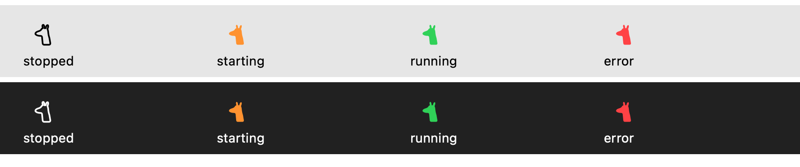
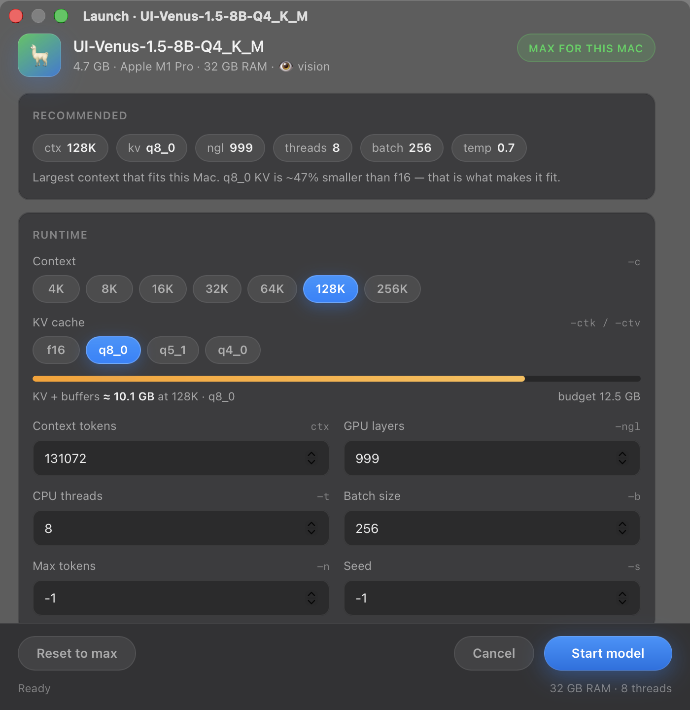
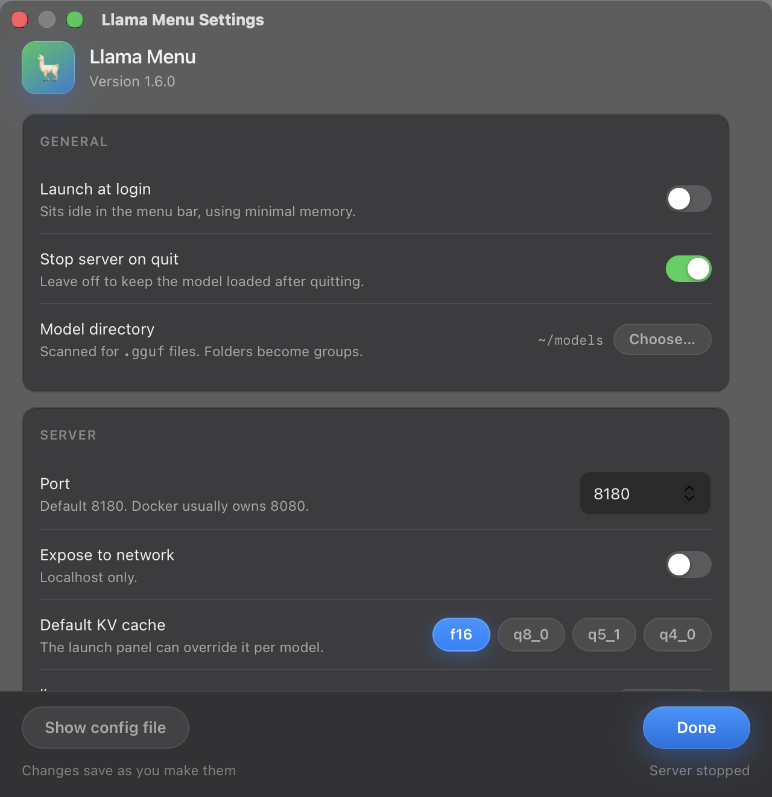

<p align="center">
  
</p>

<h1 align="center">Llama Menu</h1>

<p align="center">
  <strong>Native macOS menu bar control for local <a href="https://github.com/ggml-org/llama.cpp">llama.cpp</a></strong><br/>
  Start · switch · stop GGUF models · open chat · Metal — all on your Mac
</p>

<p align="center">
  
</p>

<p align="center">
  
  
  
  
  
  
</p>

<p align="center">
  <a href="#install">Install</a> ·
  <a href="#usage">Usage</a> ·
  <a href="#menu-bar-status">Menu bar</a> ·
  <a href="#models">Models</a> ·
  <a href="#config">Config</a>
</p>

---

## Why Llama Menu?

| | |
|:--|:--|
| **Tiny** | Native Swift menu bar host (~200 KB binary + resources) |
| **Local** | Models stay on disk; API on `127.0.0.1` only by default |
| **Smart defaults** | Context / threads / sampling tuned for *this* Mac’s RAM |
| **One click chat** | Opens llama.cpp WebUI when the server is ready |
| **Vision ready** | Auto-detects `mmproj*.gguf` next to multimodal models |

---

## Menu bar status

The live control lives in the **top-right** of the menu bar (near Wi‑Fi / clock):

<p align="center">
  
</p>

| State | Glyph |
|:--|:--|
| **Off** | Hollow llama, matching the menu bar |
| **Starting** | Solid, orange |
| **On** | Solid, green |
| **Error** | Solid, red |

The glyph is a vector template image (`resources/menu-llama-*.svg`), so it adapts
to light and dark menu bars, tinting, and Reduce Transparency on its own. Hollow
vs solid carries the state without depending on colour.

> **Tip:** If the bar is crowded, check the **`»`** overflow on the right side of the menu bar.

---

## Models

Drop GGUF files under `~/models` (folders become groups in the menu). Vision models with a sibling `mmproj*.gguf` show a 👁 marker and pass `--mmproj` automatically.

<p align="center">
  
</p>

<p align="center">
  <sub>Cards above reflect folders on this machine (Qwen, DictaLM, UI-Venus, …). Any <code>.gguf</code> works.</sub>
</p>

### Launch panel

Pick a model and get a **MAX for this Mac** window — a real `NSPanel`, not a browser
tab. It reads the model's GGUF metadata and probes RAM, free memory, perf cores and
GPU, then picks the largest context that genuinely fits, at the KV precision that
makes it fit.

<p align="center">
  
</p>

<p align="center">
  <sub>Hardware-aware max profile · live memory meter · remembered per model</sub>
</p>

### Settings

<p align="center">
  
</p>

<p align="center">
  <sub>Menu bar → <b>Settings…</b> (⌘,) · changes save as you make them</sub>
</p>

| Setting | Notes |
|:--|:--|
| **Launch at login** | Registered via `SMAppService` — no LaunchAgent plist |
| **Stop server on quit** | Turn off to keep the model loaded after quitting |
| **Model directory** | Scanned recursively for `.gguf`; folders become menu groups |
| **Port** | Default 8180 |
| **Expose to network** | Off = localhost. On binds `0.0.0.0` — read the warning |
| **Default KV cache** | Starting precision; the launch panel overrides per model |
| **llama-server** | Auto-discovered, or point it at your own build |
| **Server command** | Read-only preview of the invocation your settings produce |

### App icon

<p align="center">
  
</p>

<p align="center">
  <sub>Finder / app icon</sub>
</p>

---

## Features

- **One native binary** — no Python, no runtime dependencies, real Mach-O host
- **Real launch window** — an `NSPanel` with genuine traffic lights, not a browser tab
- **Reads the model, not just the file size** — GGUF metadata gives the exact KV
  geometry and the trained context, so context tiers above what the model
  supports are never offered
- **KV cache precision** — `f16` / `q8_0` / `q5_1` / `q4_0` with a live memory
  meter; quantizing the cache is what buys a bigger context on a fixed budget
- **Start / switch / stop** from the menu
- **Open Chat** → `http://127.0.0.1:8180/` (avoids Docker on 8080)
- **Metal** via `-ngl 999` by default
- **Health checks** — “Ready” only when `/health` answers, and it keeps checking
- **Stop server on quit** (toggle in Settings)
- **Logs** at `~/.config/llama-menu/logs/server.log` (rotated at 8 MB)

---

## Install

### Requirements

| Dependency | Notes |
|:-----------|:------|
| **macOS 13+** | Apple Silicon required (the host targets `arm64`) |
| **[llama.cpp](https://github.com/ggml-org/llama.cpp)** | `brew install llama.cpp` |
| **GGUF models** | e.g. under `~/models/**/*.gguf` |
| **Xcode CLT / Swift** | To build the native host (`swiftc`) |

The app itself has no runtime dependencies — it is a single Swift binary.

### Build & install

```sh
git clone <your-repo-url> llama-menu
cd llama-menu

# needs llama-server on PATH or at /opt/homebrew/bin/llama-server
brew install llama.cpp

./scripts/build_app.sh
./scripts/install.sh          # → /Applications/Llama Menu.app + launch
```

Build only:

```sh
./scripts/build_app.sh
open "dist/Llama Menu.app"
```

Run the tests:

```sh
./scripts/test.sh
```

Uninstall:

```sh
./scripts/uninstall.sh
./scripts/uninstall.sh --purge-config   # also wipe ~/.config/llama-menu
```

---

## Usage

1. Click the **llama glyph** in the **menu bar** (top-right).
2. **Start Model** → pick a `.gguf`.
3. The **launch panel** opens with the recommended profile for this Mac — tweak it or hit **Start model**.
4. Wait for **Ready** (notification, and the glyph turns green).
5. **Open Chat** or call the API:

```sh
# List models
curl http://127.0.0.1:8180/v1/models

# Chat completion
curl http://127.0.0.1:8180/v1/chat/completions \
  -H "Content-Type: application/json" \
  -d '{
    "model": "YOUR-MODEL.gguf",
    "messages": [{"role": "user", "content": "Hello"}]
  }'
```

> **Port:** default is **8180** (Docker often owns **8080**).

---

## Config

`~/.config/llama-menu/config.json`

| Key | Default | Notes |
|-----|---------|--------|
| `llama_server` | auto | Path to `llama-server` |
| `models_dir` | `~/models` | Recursive `*.gguf` scan |
| `host` | `127.0.0.1` | Use `0.0.0.0` only if you accept LAN risk |
| `port` | `8180` | Prefer ≠ 8080 if Docker is installed |
| `ngl` | `999` | GPU layers (Metal) |
| `batch` | `512` | Batch size |
| `threads` | auto | Perf cores |
| `kv_cache_type` | `f16` | Default KV precision; per-model prefs override it |
| `stop_server_on_quit` | `true` | Stop `llama-server` when quitting the menu |

Unknown keys are ignored and missing keys fall back to defaults, so the file is
safe to hand-edit.

Per-model launch prefs: `~/.config/llama-menu/model_prefs.json`

### KV cache precision

The KV cache is usually what limits context, not the weights. It scales linearly
with context, so halving its precision roughly doubles the context that fits:

| Type | Bytes/element | Relative size | Notes |
|:-----|:--------------|:--------------|:------|
| `f16` | 2 | 100% | Default, lossless |
| `q8_0` | 1.0625 | ~53% | Near-lossless; auto-picked when it buys more context |
| `q5_1` | 0.75 | ~38% | Noticeable on long reasoning chains |
| `q4_0` | 0.5625 | ~28% | Smallest; measurable quality cost |

Anything below `f16` passes `-fa on`, since a quantized V cache requires flash
attention. Sizes are computed from GGUF metadata and match `llama-server`'s own
reported allocation exactly.

---

## Project layout

```text
llama-menu/
├── NativeHost/              # The entire app — one Swift binary, no runtime deps
│   ├── main.swift           # Entry point + single-instance lock
│   ├── AppController.swift  # Status item, menu, server lifecycle
│   ├── LaunchPanel.swift    # NSPanel + WKWebView settings window
│   ├── Recommender.swift    # Profile selection, KV sizing, param sanitizing
│   ├── GGUF.swift           # GGUF metadata reader (trained ctx, KV geometry)
│   ├── Hardware.swift       # RAM / cores / GPU probe
│   ├── Config.swift         # config.json + per-model prefs
│   └── Util.swift           # Paths, logging, model discovery
├── Tests/main.swift         # Hermetic logic tests
├── resources/               # Icons + launch.html (the panel UI)
├── docs/assets/             # README images
├── scripts/
│   ├── build_app.sh         # Compile Swift → dist/Llama Menu.app
│   ├── test.sh              # Run Tests/
│   ├── install.sh
│   └── uninstall.sh
└── VERSION
```

---

## Security

- Binds to **localhost** by default — nothing leaves your machine unless you change `host`.
- The launch panel is an in-process `WKWebView` loading local HTML with a nil
  base URL, so it has an opaque origin and no network access. It runs no local
  HTTP server, which is what a page in a browser tab would have required.
- Values from the panel are clamped in Swift before they reach the command line,
  and the `mmproj` path always comes from a disk scan rather than the page.
- Llama Menu only ever signals `llama-server` processes on **its own configured
  port**, so servers you started yourself are left alone.
- App is **unsigned**. First launch may need **System Settings → Privacy & Security → Open Anyway**.
- Do not expose `0.0.0.0` unless you understand the risk of an open OpenAI-compatible API on your network.

---

## Credits

- [**llama.cpp**](https://github.com/ggml-org/llama.cpp) — engine & WebUI  

---

## License

[MIT](LICENSE) © Llama Menu contributors

<p align="center">
  <sub>100% local · Metal · GGUF</sub>
</p>
